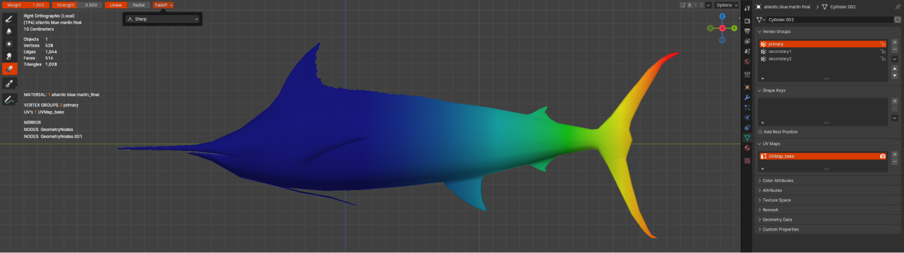
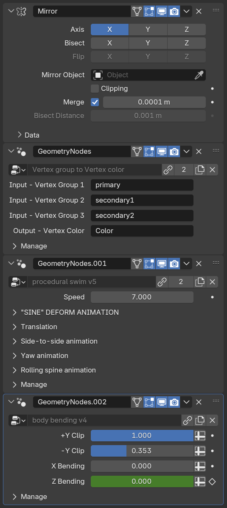

# Assets

An asset is any 3D resource — such as a fish model, a piece of coral, or a human artifact. The assets for Oceanviz exist in 2 states: Assets begin as artist-friendly, editable files (often in Blender) and are then exported into a format (like GLB GLTF) suitable for Unity’s runtime environment.

 The source assets can be found in `OceanViz3/SourceAssets/Models` and are typically Blender files. The published assets exist within the `OceanViz3/Assets/StreamingAssets` folder in Unity.

## Working with Source Assets
- The general workflow is to use Blender to create a 3D model, then export it as a GLB GLTF file for Unity.
- Keep the triangle count as low as possible (500-2000 is a good range). If the model is animated (eg. fishes), try to create it as a connected mesh.
- Model should have a single material. Textures follow the standard PBR standard, and can include base_color, normal, roughness, and metallic channel. Alpha channel in the color map is supported, but should be used sparingly.  If no texture is present, 0.0 metallic and 0.5 roughness is assigned.
- Model will be rendered with the backface being invisible, so ensure that no backfacing polygons are expected to be visible.
- The model must be aligned with the -Y axis. In other words, from a top view in Blender, the model’s “front” or “nose” should point toward the bottom of the screen.
- Use a lot of reference images; fishbase.se is a good place to start

### Animating Assets
Oceanviz uses a procedural, GPU-based animation system that can quickly animate thousands of fish at high framerate. Instead of playing back traditional skeletal animations frame-by-frame, the animation is driven by a vertex shader that procedurally displaces vertices over time to simulate realistic swimming movements or other natural motions.

(Note that the animation system described here is only responsible for handling the in-place animation of an entity, it doesn't handle the actual locomotion of the entity, which involves path-finding and some boid-like schooling algoritm, which are handled separately)

To control the animation effect on a per-asset basis, there is a list of parameters that the shader requires for things like the frequency of tee motion as well as the direction of the motion.  Furthermore, vertex colors stored within the model’s geometry acts as finer control to give the shader even more information about how to deform the model.

GPU Animation Using Vertex Paint:
- In Blender, artists paint vertex colors or use vertex groups to define how different regions of the mesh should move. For example, the head of a fish may receive one color weight, while the tail receives another. These vertex colors essentially become data channels that control the amount and direction of deformation.


- To automate the process of converting vertex groups into vertex colors, Use the provided Geometry Node Group named `Vertex group to vertex color` in `OCEANVIZ NODETREES.blend`. After setting up vertex weights on your mesh, applying this node group populates the vertex colors accordingly.

- All assets share the same basic procedural animation system, Use the provided Geometry Node Group named `procedural swim v5` in `OCEANVIZ NODETREES.blend`.

- Finally, to give the dynamic assets such as fish further realism, we apply a gentle bending along the spine when the fish is turning, this makes the swim cycle feel a lot more natural. The Node Group `body bending v4` handles this.

- The entire modifier stack for a typical asset look like this:



The same procedural shaders exist in Blender as a geometry nodes, and in Unity as a shadergraph. This way, artist can author the animation in Blender and expect it to look identical in Unity.

### Exporting Assets
Before exporting:
1. Apply all transforms
2. Remove all unused uv slots; remember: just one uv layout needed
3. Export the object in a “neutral” position, meaning that If the object is animated (eg. a fish), disable (do not remove) geometry node named `Procedural swim` and `body bending`: its values will be needed for final animation in Unity.
4. If your model is also using armature to be animated, make sure the animation is looping smoothly; bake also animation to keyframes (only for export)
5. Export model as GLB to `StreamingAssets/Entities/NameOfEntity/`  using the default settings plus these changes:
    - Limit to: selected objects
    - Data-Mesh-Apply modifiers
    - Material: no export


# Working with Streaming Assets
Once the GLB assets have been exported, Unity will be able to load them on the fly during runtime.  Ensure that the directory structure of your newly created asset matches the following:

```StreamingAssets:
├─ DynamicEntities/
│  ├─BlueFinTuna/
│  │   ├─ Model.glb
│  │   ├─ base_color.png
│  │   ├─ normal.png
│  │   ├─ Entity.json
├─ DynamicEntities/
│  ├─SeaGrass/
│  │   ├─ Model.glb
│  │   ├─ Diffuse.png
│  │   ├─ Entity.json
├─ Locations/
│  │   ├─ MediterreaneanCoast.json
│  │   ├─ Baltic.json
│  │   ├─ Azures.json
```

The final step is to create a valid Entity.json file for the asset. This file should include all the parameter values you've configured within Blender’s geometry nodes—transfer them directly to the JSON so that the Unity runtime can accurately replicate the intended transformations and behaviors.
