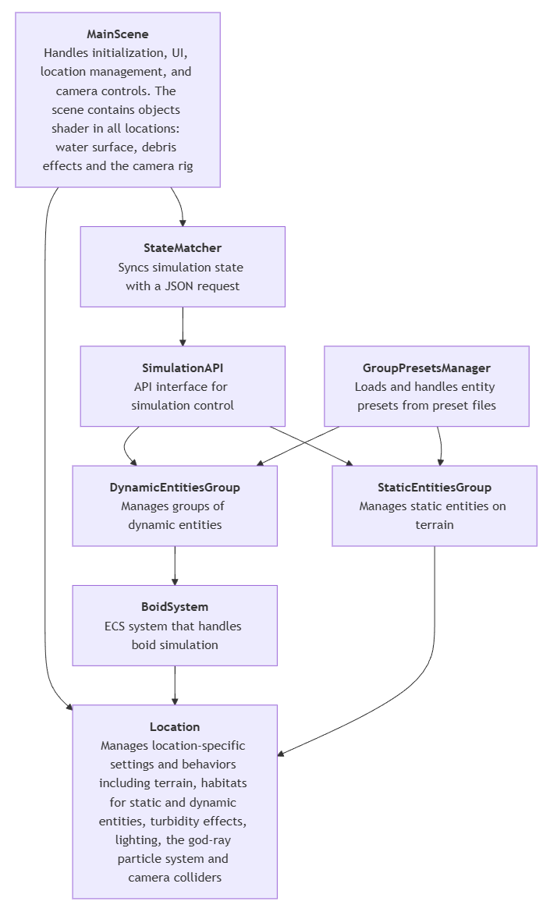

# Architecture
### Terminology
`Entity` is any living thing we can use to populate the world - fish, coral, seagrass, etc. An entity is made up of a 3D model, image textures, and a collection of parameters in a json file. An entity can be dynamic (e.g. fish) or static (e.g. oysters).

`Location` represents an environment, which is effectively our 'level', or 'map' in gaming terms. For example, “Western Mediterranean” is a location. The location is conceptually separated from the Entity. It doesn't define or care about the entities which occupy it.

Within a location, there can be multiple `habitats`, which are smaller regions that have distinct ecological properties. They are currently mostly used to help to define the distribution of entities. i.e. coral fish will only stick to coral reef habitats, seagrass will only grow in sandy habitats, not rocks. 

`Client` is the side of the application that visualizes the data in 3D. In most cases, it’s synonymous with OceanViz.

`Server` is the application that provides the ecosystem data to the client. In most cases it’s either Ecopath with Ecosim (EwE) or a similar program.

### Overview

### Coding Style Conventions
Both Unity and C# recommends the PascalCaseNamingConvention, which is what we aim to use within our framework.

